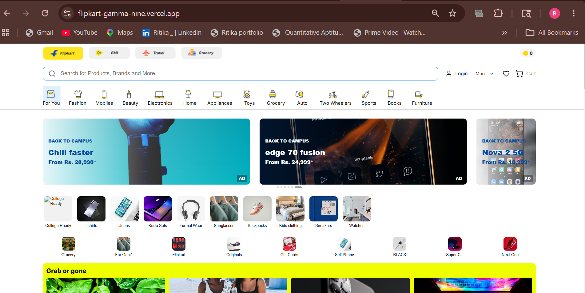
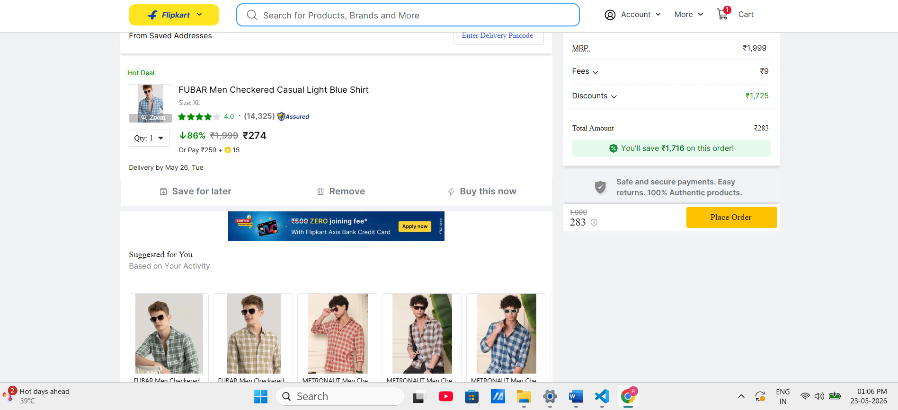
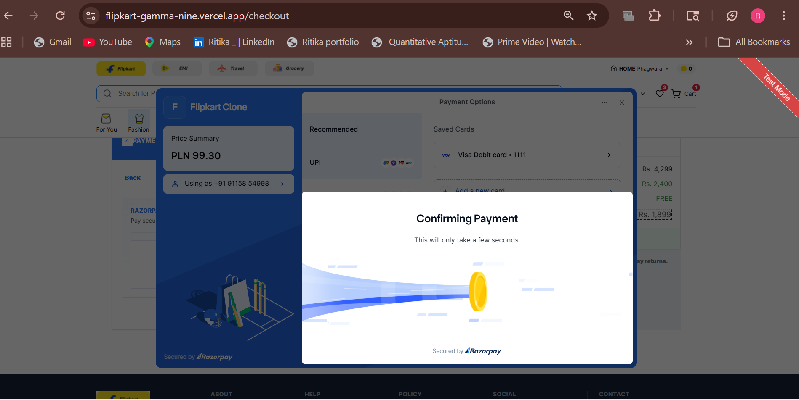
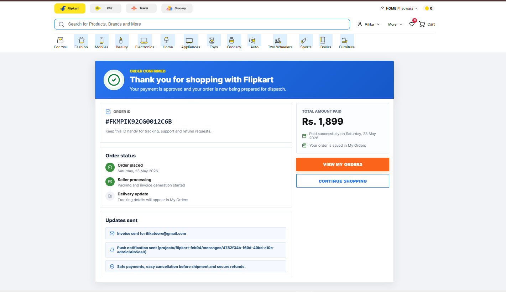
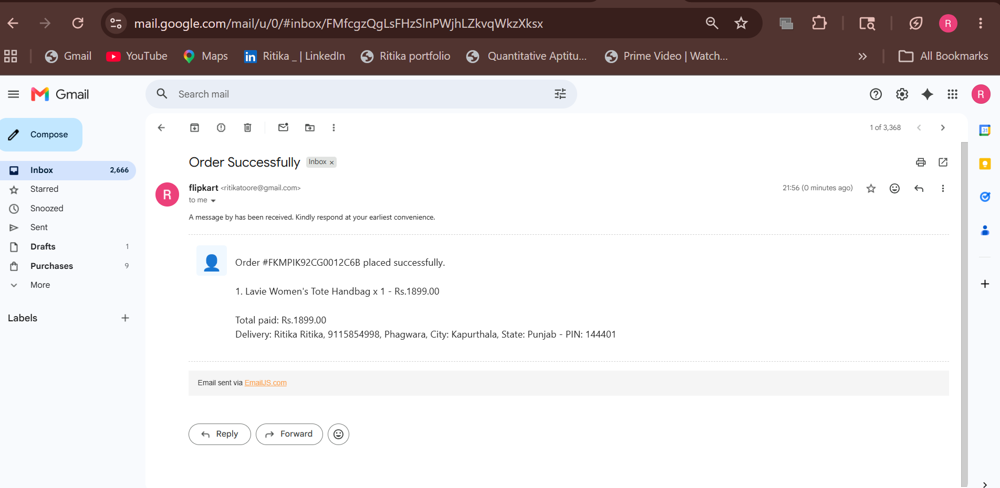
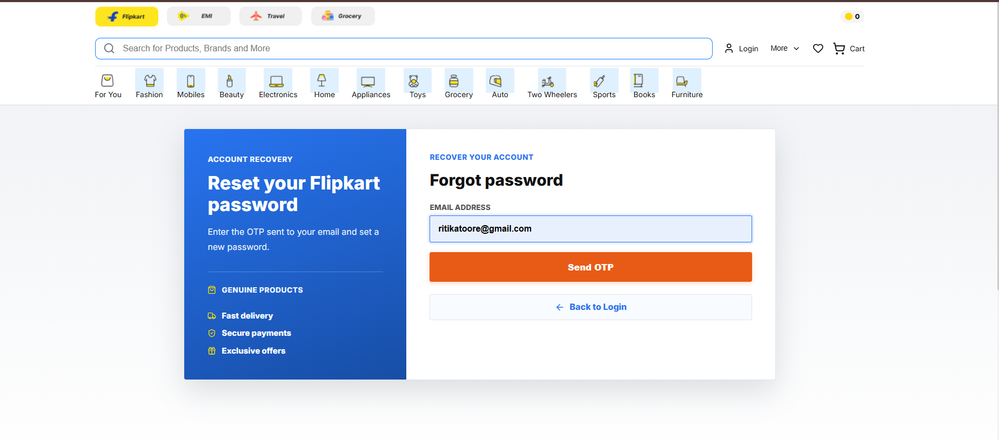
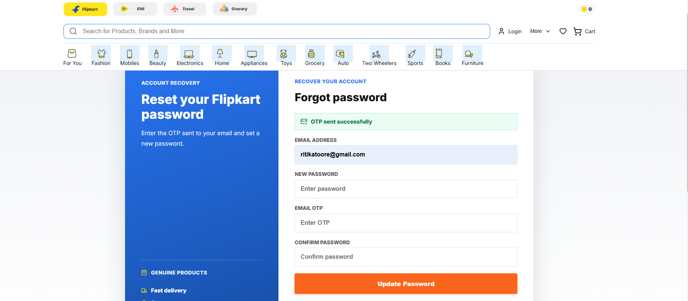
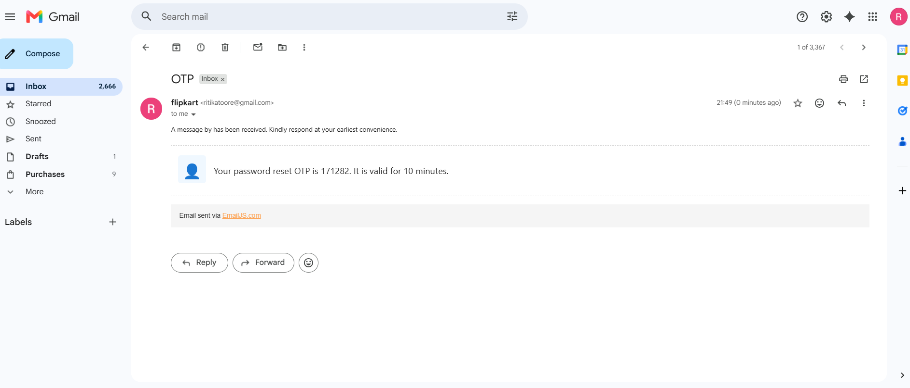
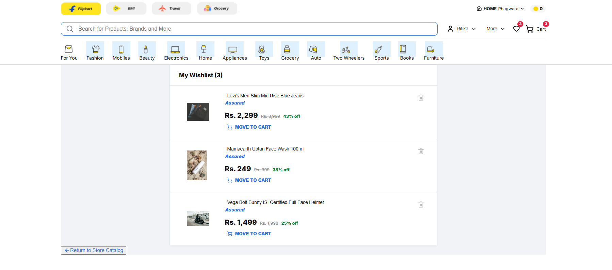
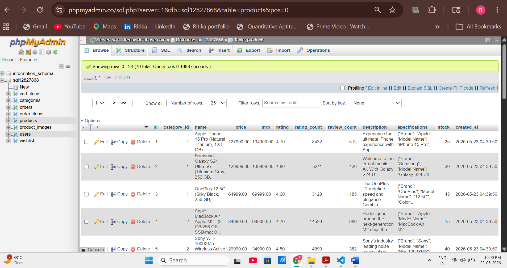

# 🛒 Flipkart Clone – Full Stack E-Commerce Platform

A fully functional Flipkart-inspired e-commerce web application built as part of an **SDE Intern Fullstack Assignment**.

This project focuses on creating a real-world online shopping experience similar to Flipkart with modern UI, cart management, authentication, checkout flow, and Razorpay payment integration.

The application is fully responsive and works smoothly across desktop, tablet, and mobile devices.

---

# 🌐 Live Demo

🔗 https://flipkart-gamma-nine.vercel.app

---

# ✨ Features

## 🏠 Product Listing
- Flipkart-style homepage UI
- Product grid layout
- Product search functionality
- Category-based filtering
- Responsive product cards

### 📸 Homepage Screenshot



---

## 📦 Product Details Page
- Multiple product images
- Product descriptions & specifications
- Stock availability
- Add to Cart
- Buy Now functionality

---

## 🛒 Shopping Cart
- Add/remove products
- Update quantity
- Dynamic subtotal & total price
- Persistent cart functionality

### 📸 Cart Screenshot



---

## 💳 Checkout & Payments
- Shipping address form
- Order summary
- Razorpay payment integration
- Secure order placement

### 📸 Razorpay Payment Screenshot



---

## ✅ Order Success
- Order confirmation page
- Unique order ID generation

### 📸 Order Success Screenshot



---

## 📧 Order Success Mail



---

# 🔐 Authentication

This project includes complete authentication functionality:

- User Signup
- User Login
- JWT Authentication
- Protected Routes
- Forgot Password
- OTP Verification

### 📸 Forgot Password Screenshot



---

### 📸 Forgot Password OTP Screenshot



---

### 📸 Mail OTP Screenshot



---

# ❤️ Wishlist Functionality

- Add products to wishlist
- Remove products from wishlist
- Persistent wishlist storage

### 📸 Wishlist Screenshot



---

# 👨‍💻 Demo Login Credentials

```txt
Email: demo@gmail.com
Password: Demo@123
```

---

# 🛠️ Tech Stack

## 🎨 Frontend
- React.js
- Tailwind CSS
- Axios

## ⚙️ Backend
- Node.js
- Express.js

## 🗄️ Database
- MySQL

## 🔑 Authentication
- JWT Authentication

## 💳 Payment Gateway
- Razorpay

## ☁️ Deployment
- Vercel

---

# 📁 Project Structure

```bash
project-root/
│
├── client/                 # Frontend
│   ├── components/
│   ├── pages/
│   ├── styles/
│   └── utils/
│
├── server/                 # Backend
│   ├── controllers/
│   ├── routes/
│   ├── middleware/
│   ├── models/
│   └── config/
│
├── screenshots/            # Project screenshots
│
├── .env.example
└── README.md
```

---

# 🧠 Database Design

The database is designed using proper relational structure in MySQL.

Main tables used:
- Users
- Products
- Cart
- Orders
- Order Items

Relationships are handled using foreign keys.

### 📸 Database Schema Screenshot



---

# 💳 Razorpay Integration

Razorpay payment gateway is integrated using Test Mode APIs.

Features:
- Online payment flow
- Secure payment verification
- Backend payment validation

⚠️ For security reasons, secret keys are not uploaded publicly.

---

# ⚡ Setup Instructions

## 1️⃣ Clone Repository

```bash
git clone https://github.com/Ritikaa2/Flipkart.git
```

---

## 2️⃣ Open Project Folder

```bash
cd project-name
```

---

# 💻 Frontend Setup

```bash
npm install
npm run dev
```

---

# ⚙️ Backend Setup

```bash
npm install
npm start
```

---

# 🔑 Environment Variables

Create a `.env` file inside the backend folder.

## 📄 .env.example

```env
PORT=5000
NODE_ENV=development

CLIENT_URL=http://localhost:5173
CLIENT_URLS=https://flipkart-gamma-nine.vercel.app,http://localhost:5173

# MySQL Database Configuration
DB_HOST=localhost
DB_USER=root
DB_PASSWORD=your_password
DB_NAME=flipkart
DB_PORT=3306

# JWT Authentication
JWT_SECRET=your_super_secret_jwt_key_here
JWT_EXPIRE=24h

# Razorpay Payments
RAZORPAY_KEY_ID=your_razorpay_key
RAZORPAY_KEY_SECRET=your_razorpay_secret

RAZORPAY_ALLOW_DEMO_FALLBACK=true
RAZORPAY_FORCE_DEMO_QR=false
```

⚠️ Never upload your real `.env` file or secret keys publicly.

---

# 🚀 Features Implemented

✅ Product Listing  
✅ Product Search  
✅ Category Filter  
✅ Product Details Page  
✅ Shopping Cart  
✅ Quantity Update  
✅ Remove from Cart  
✅ Checkout Flow  
✅ Razorpay Integration  
✅ JWT Authentication  
✅ Forgot Password  
✅ OTP Verification  
✅ Wishlist Functionality  
✅ Responsive Design  
✅ Order Placement  

---

# 📱 Responsive Design

The application is optimized for:
- Desktop
- Tablet
- Mobile Devices

---

# 📌 Assumptions

- Users can browse products without login
- Login is required before placing orders
- Razorpay is integrated in Test Mode
- Sample products are manually seeded into database

---

# 🔮 Future Improvements

Some features planned for future:
- 📦 Order history
- ⭐ Product reviews & ratings
- 🛠️ Admin dashboard
- 📧 Email notifications
- 🔍 Advanced filtering & sorting

---

# 👨‍💻 Developer

Developed by **Ritika**

---

# 📜 Disclaimer

This project was built for educational and assignment purposes only.

All product images, logos, and brand names are used only for demonstration purposes.
